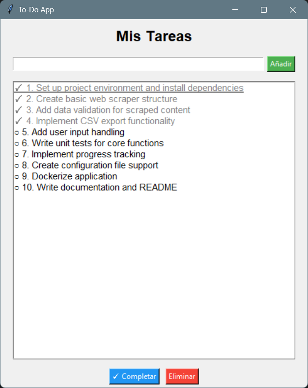

# To-Do App con Interfaz Gráfica

Una aplicación de gestión de tareas con GUI usando **tkinter**.

## Funcionalidades
- Añadir tareas
- Marcar como completadas
- Eliminar tareas
- Persistencia en `tasks.json`

## Requisitos
- Python 3.6+

## Uso
```
python main.py
```

## Captura de pantalla

