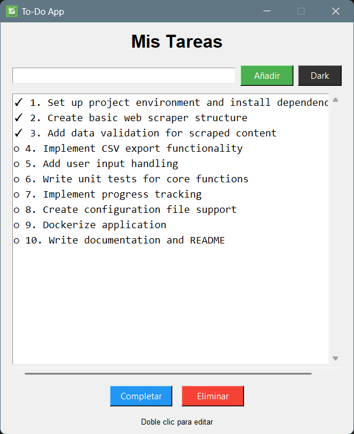
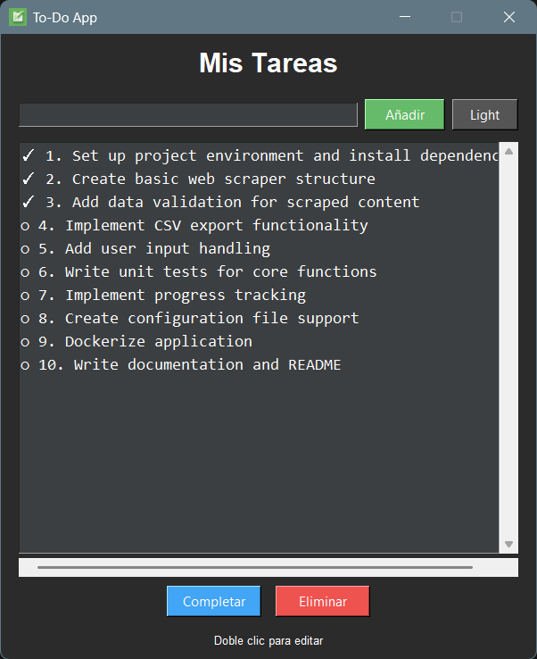

# To-Do App con Interfaz Gráfica

Una aplicación de gestión de tareas con GUI usando **tkinter**.

## Funcionalidades
- Añadir tareas
- Marcar como completadas
- Eliminar tareas
- Persistencia en `tasks.json`
- Selección de tema Claro/Oscuro
- Editar tareas con doble clic

## Requisitos
- Python 3.6+

## Uso
```
python main.py
```

## Captura de pantalla
### Modo claro



### Modo oscuro




## Licencia
Este proyecto está bajo la licencia **MIT** - ver archivo [LICENSE](LICENSE) para detalles.
